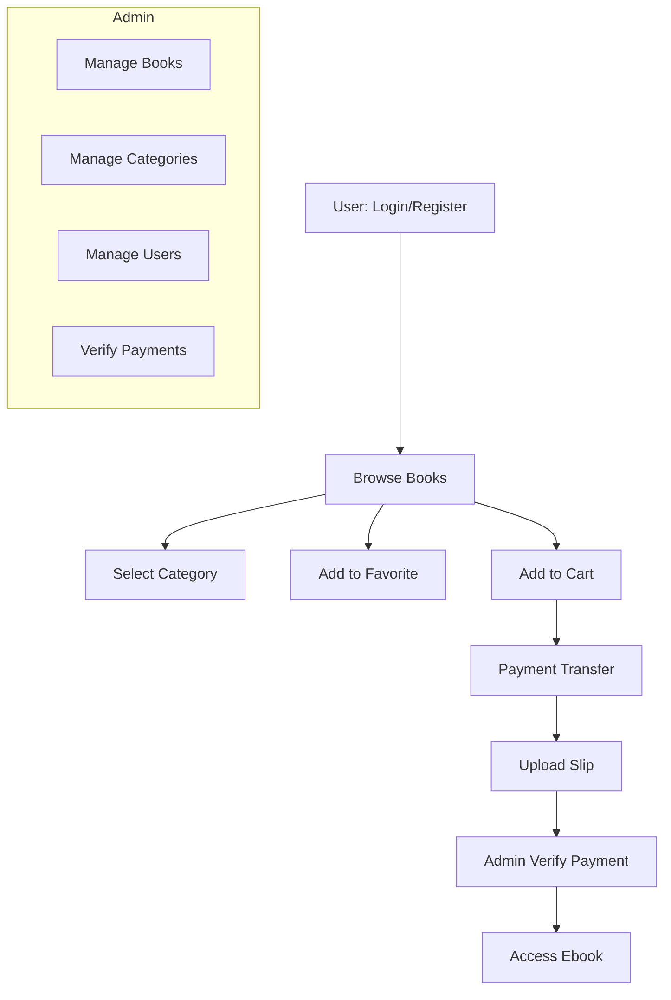

# 📚 Web Application for Ebook Rental
**วิชา:** CP410805 - Web Application Development การพัฒนาโปรแกรมประยุกต์บนเว็บ (ปีการศึกษา 2025)  

โปรเจกต์นี้เป็นเว็บแอปพลิเคชันสำหรับการเช่า Ebook เพื่ออ่านออนไลน์
ผู้ใช้สามารถสมัครสมาชิก เข้าสู่ระบบ ค้นหาหนังสือจากหมวดหมู่ เพิ่มหนังสือในตะกร้า/รายการโปรด และทำการชำระเงินเพื่อปลดล็อกการอ่าน
ฝั่งผู้ดูแลระบบ (Admin) สามารถจัดการข้อมูลหนังสือ หมวดหมู่ ผู้ใช้งาน และตรวจสอบการโอนเงิน

**เป้าหมายของระบบ:**

* อำนวยความสะดวกให้ผู้ใช้งานเข้าถึงหนังสือได้ง่าย
* จัดการการเช่าและการอ่าน Ebook อย่างเป็นระบบ
* เพิ่มช่องทางรายได้ผ่านการให้บริการเช่า Ebook

---

* **Members:**
  - **นายชัชติยะ สินธุธรรม** (รหัส: `663380032-0`)  
  - **นายกฤติศักดิ์ นนทะคำจัน** (รหัส: `663380250-0`)  
  - **นายภานุวัชร์ นุ่นหลักคำ** (รหัส: `663380289-3`)  
  - **นายเชิดตระกูล แข็งขัน** (รหัส: `663380305-1`)  
  - **นายจักรพรรดิ์ มั่งกูล** (รหัส: `663380518-4`)  

---

## 🚀 Features

### 👤 User

* สมัครสมาชิก / เข้าสู่ระบบ
* ดูหนังสือและรายละเอียด
* เลือกตามหมวดหมู่
* เพิ่มใน **รายการโปรด**
* เพิ่มลง **ตะกร้า**
* ชำระเงิน (โอนเงิน + อัปโหลดสลิป)

### 🛠️ Admin

* จัดการข้อมูลหนังสือ (เพิ่ม/แก้ไข/ลบ)
* จัดการหมวดหมู่
* จัดการผู้ใช้
* ตรวจสอบและยืนยันการโอนเงิน

---

## 🛠️ Technologies Used

* **Frontend:** HTML5, Jetsteam, PHP, CSS
* **Backend:** **นายจักรพรรดิ์ มั่งกูล**, **นายเชิดตระกูล แข็งขัน**, **นายกฤติศักดิ์ นนทะคำจัน**, **นายชัชติยะ สินธุธรรม**
* **Database:** MySQL
* **Authentication:** 
* **Payment Integration:** 

---

## 🔄 System Flow



---

## 🎭 Use Case Diagram

```mermaid
usecaseDiagram
actor User
actor Admin

User --> (Register / Login)
User --> (Browse Books)
User --> (Select Category)
User --> (View Book Details)
User --> (Add to Favorite)
User --> (Add to Cart)
User --> (Make Payment)
User --> (Upload Slip)
User --> (Read Ebook)

Admin --> (Manage Books)
Admin --> (Manage Categories)
Admin --> (Manage Users)
Admin --> (Verify Payments)
```

---
