# 📚 Project Name (Web Application for Ebook Rental)

## 📖 Description

โปรเจกต์นี้เป็นเว็บแอปพลิเคชันสำหรับการเช่า Ebook เพื่ออ่านออนไลน์
ผู้ใช้สามารถสมัครสมาชิก เข้าสู่ระบบ ค้นหาหนังสือจากหมวดหมู่ เพิ่มหนังสือในตะกร้า/รายการโปรด และทำการชำระเงินเพื่อปลดล็อกการอ่าน
ฝั่งผู้ดูแลระบบ (Admin) สามารถจัดการข้อมูลหนังสือ หมวดหมู่ ผู้ใช้งาน และตรวจสอบการโอนเงิน

**เป้าหมายของระบบ:**

* อำนวยความสะดวกให้ผู้ใช้งานเข้าถึงหนังสือได้ง่าย
* จัดการการเช่าและการอ่าน Ebook อย่างเป็นระบบ
* เพิ่มช่องทางรายได้ผ่านการให้บริการเช่า Ebook

---

## 👥 Group Information

* **Subject:** __________________________
* **Instructor:** __________________________
* **Members:**

  1. ---
  2. ---
  3. ---
  4. ---

---

## 🚀 Features

### 👤 User

* สมัครสมาชิก / เข้าสู่ระบบ
* ดูหนังสือและรายละเอียด
* เลือกตามหมวดหมู่
* เพิ่มใน **รายการโปรด**
* เพิ่มลง **ตะกร้า**
* ชำระเงิน (โอนเงิน + อัปโหลดสลิป)

### 🛠️ Admin

* จัดการข้อมูลหนังสือ (เพิ่ม/แก้ไข/ลบ)
* จัดการหมวดหมู่
* จัดการผู้ใช้
* ตรวจสอบและยืนยันการโอนเงิน

---

## 🛠️ Technologies Used

* **Frontend:** ____________
* **Backend:** ____________
* **Database:** ____________
* **Authentication:** ____________
* **Payment Integration:** ____________

---

## 🔄 System Flow

```mermaid
flowchart TD
    A[User: Login/Register] --> B[Browse Books]
    B --> C[Select Category]
    B --> D[Add to Favorite]
    B --> E[Add to Cart]
    E --> F[Payment Transfer]
    F --> G[Upload Slip]
    G --> H[Admin Verify Payment]
    H --> I[Access Ebook]

    subgraph Admin
        H1[Manage Books]
        H2[Manage Categories]
        H3[Manage Users]
        H4[Verify Payments]
    end
```



---

## 🎭 Use Case Diagram

```mermaid
usecaseDiagram
actor User
actor Admin

User --> (Register / Login)
User --> (Browse Books)
User --> (Select Category)
User --> (View Book Details)
User --> (Add to Favorite)
User --> (Add to Cart)
User --> (Make Payment)
User --> (Upload Slip)
User --> (Read Ebook)

Admin --> (Manage Books)
Admin --> (Manage Categories)
Admin --> (Manage Users)
Admin --> (Verify Payments)
```

---
